# 🏢 Right That's It
<i>3D platformer</i>

That pesky drone is at it again! Firing lasers in the city!

Jump and glide from building to building; power-punching into enemy frogs; bouncing off
springboards and sliding onto moving platforms, all to put a stop to its havoc.

Beware spikes and sinking blocks. Avoid its attacks and use the environment to clamber
atop its body and squash the fella.

### [Watch The Trailer Now!](https://drive.google.com/file/d/1nuTgb25DW_W3_slszHuMdmmYxsjFNlBb/view?usp=sharing)

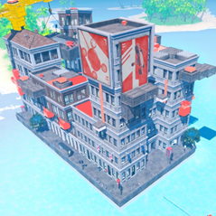
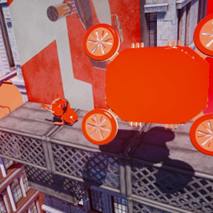
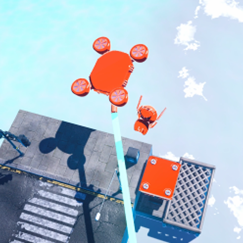

### Explore The City

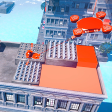
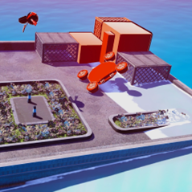
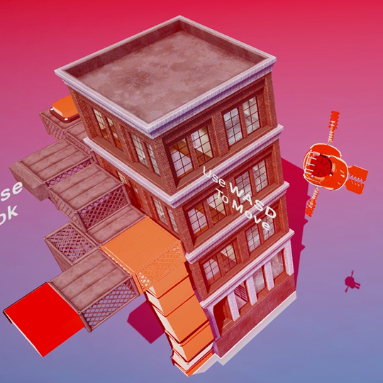

### Fight The Drone

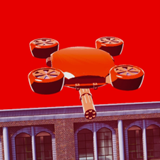
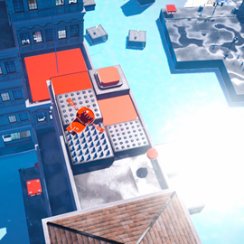
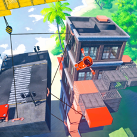

### Glide, Grapple, Jump, Boost

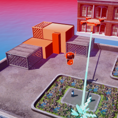
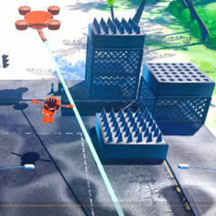
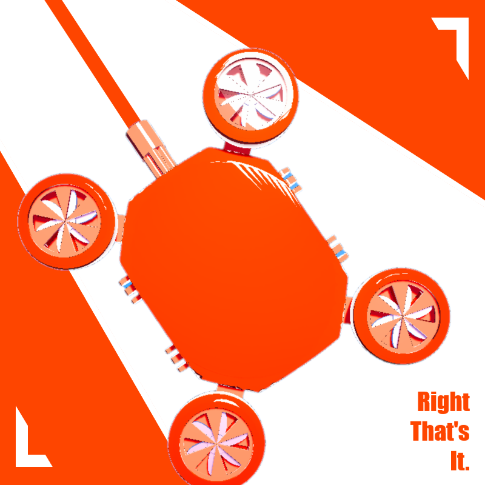

### Initial Design Process Sketch
Outlines the key mechanics:

